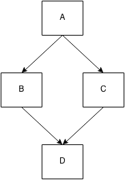

# “类”与对象的混合(Mixing Up "Class" Objects)

根据过往的经验，我们很容易将“面向对象”(object orientation)的思想，关联到“面向类”(class orientation)上 —— 实例化(instantiation)、继承(inheritance)、多态(polymorphism) —— 但这些面向类的思想 *映射(map)* 在JS的对象机制中时，并不太自然。

## 类的理论(Class Theory)
“类/继承” 描述某种代码的组织和架构形态 —— 是一种在软件世界中模拟现实世界面临的实际的问题的一种方法。

面向对象/类的编程语言强调的是根据数据的不同的类型和特性，将数据从本质上和行为关联起来，以此将数据和行为合理的打包、封装在一起。在计算机科学领域，这被称为“数据结构”(data structures)。

例如，有一系列用来代表单词或词组的 字符(characters) 通常被称为 “字符串”(string)。这些 字符(characters) 就是数据，但你关心的只是如何操作这些数据，而不是数据本身。因此一些操作数据(字符)的行为，都被设计成 `String` 类的方法。而所有给定的字符串，都是这个类的实例，这也意味着它不仅包含了字符数据，也能执行相应的方法功能。

类也是一种对数据结构的分类 —— 将任何一种数据结构看做是一个更通用定义下，某个特定的变体。举个例子，汽车类可以被看成是交通工具类的一个特殊的实现。而交通工具类的定义应该具有推进器、载人能力等功能 —— 它应该是其他交通工具(飞机、轮船、火车)所共同具有的特征。

而一旦定义好了交通工具类，汽车类则只需要继承它，而不需要再重复的去定义诸如 “载人能力” 等功能。而实例化的汽车则只需要譬如唯一的 VIN 码之类的数据即可。

另一个类的关键概念是 多态，它描述的是子类能够重写父类的同名方法。实际上，相对的多态能够既让我们使用基本的父类行为的同时，还能自定义子类的其他行为。但在JS代码中实现这些功能，可能会让你迷惑，且又让代码变得脆弱。

### “类”的设计模式("Class" Design Pattern)
你或许从未想过将 “类” 做为一种设计模式，毕竟我们通常讨论的都是面向对象的设计模式，譬如 “迭代器模式”、“观察者模式”、“工厂模式”、“单例模式”……大多数的假设都认为 面向对象的类 是实现高级设计模式的基础，就好像面向对象是所有代码的基础一样。

面向过程编程 同样也是一种编程的范式 —— 没有高级的抽象，只是由调用函数的过程所组成 —— 你可能会认为 类 是解决这些 “意大利面条代码(spaghetti code)” 的良方。你可能知道 函数式编程，明白 类 只是常见的程序设计的一种，但对于其他人来讲，这可能是你问自己的一次好机会：类是否真的是所有代码的基础？还是它只是一种的可选抽象模式。

有些编程语言没得选，比如Java —— everything's a class。另一些语言，比如 C++ 和 PHP，同时提供了面向过程和面向对象的语法，从而让开发者能够选择合适的模式。

### JS中的类(Javascript "Classes")
JS中有很多关于类的语法，比如 `new` 和 `instanceof`，并且在ES6中还新增了关键字 `class` 等。但这就意味着JS中真正存在类么？简单明了 —— 没有。

JS仅仅通过一系列的形似 “类” 的语法，来满足进行 “类” 设计的需求，但并没有真正支持 “类” 的机制 —— 语法糖和广泛使用的 “类” 库好像隐藏了这一切，但在底层，无论是构建“类”还是操作“类”的机制都和其他拥有“类”的语言完全不同。

## 类的机制(Class Mechanics)
在大多数 面向类(class-oriented) 的语言中，栈(stack) 这种数据结构都应是标准供应的。比如一个 `Stack` 类，应该具有一组内置的变量用于存储数据，同时也有一组用于和数据交互的公开的方法。

在这些语言中，你不需要直接和 `Stack` 类交互。`Stack` 类只是一个对于 栈(stack) 这种数据结构应该做什么的抽象，它自身并不是一个 栈。在你需要操作具体的数据结构时，你应该实例化这个 `Stack` 类。

### 建筑(Building)
对于 “类(class)” 和 “实例(instance)” 的隐喻是来自于建筑学。

一个建筑师会罗列出一个建筑物的所有特征：多宽、多高、有多少窗户、在什么位置，甚至是墙和屋顶的材料类型……但他不会关心建筑将建在什么地方，也不会在意会有多少建筑会根据这个蓝图所创建。他甚至不用考虑建筑内部的具体内容 —— 家具、墙纸、天花板…… —— 只会关心它们将被包含在什么类型的建筑结构中。

建筑师绘制的建筑蓝图只是一个建筑施工的计划，它并不包含真实的建筑。我们需要建筑工人去完成这个施工计划，建筑工会根据蓝图去施工。从实际的角度出发，建筑工是将施工计划中建筑的特性逐一复制到实体的建筑中去。

一旦建筑施工完成，建筑就是施工蓝图的一个具体的实例化，一个从本质上来看完美的副本。接下去，建筑工会继续挪到下一处空地，把相同的事情再做一遍，创造出另外一个副本。

实体建筑和施工蓝图之间的关系是间接的。你可以通过施工蓝图去理解建筑的具体构造，而不是直接去检查建筑自身的某个部位。但如果你想打开一扇门，那么你必须进入这个建筑中去 —— 建筑蓝图只是在纸上画了一些线段，代表门应该在什么地方。

“类” 就是建筑蓝图。想要获得一个能实际交互的对象，我们必须基于类去实例化。“施工”的产出就是一个对象，通常称为“实例” —— 我们能直接在上面调用方法，也能从中获取任何公开的属性。

**这个对象就是 具有类所描绘的所有的特征的 副本。**

就像你不会到一个建筑里面去搜寻蓝图，然后将它的副本裱起来，并挂在墙上一样，你通常不会用一个实例化的对象去直接操作一个类。但判断这个对象是由哪一个类实例化而来则是常见的需求。

考虑类和实例的直接关系，而不是实例对象和类来源的间接关系。**一个类实例化成一个对象是通过复制操作。** 比如下图，箭头方法代表了复制操作的产生，概念上和物理上都有：


### 构造函数(Constructor)
类的实例的构建通常是由类中一个特殊的方法完成，这个方法一般和类同名，被成为构造函数(constructor)，它的工作就是显示地初始化实例所需要的数据。

比如👇下面的伪代码：
```js
class CoolGuy {
  specialTrick = 'nothing'

  CoolGuy (trick) {
    specialTrick = trick
  }

  showOff () {
    output('Here is my trick:' + specialTrick)
  }
}
```

实例化一个 `CoolGuy`，只需要调用类的构造函数：

```js
Joe = new CoolGuy('jumping rope')

Joe.showOff()
```

`CoolGuy` 类在使用 `new CoolGuy(..)` 会直接调用构造函数 `CoolGuy ()`，随后会返回一个实例化的对象，在这个对象上能调用 `showOff()` 输出某个 `CoolGuy` 的特殊技能。

*跳绳显然让 Joe 变得很酷*

构造函数属于类，通常和类同名。`new` 关键字能让编程语言的引擎知道你想要构造出一个类的实例对象。

## 类的继承(Class Inheritance)
在面向类的语言中，无论是定义一个用于实例化的类，亦或定义一个继承于其他类的类，都是可以的。一般来讲，被继承的类称为 “父类”，继承它的类被称为 “子类”。这种称谓来自于现实世界的抽象，但显然这样的抽象有点夸张了 —— 当父母有一个亲生的孩子时，他们孩子的基因复制于他们。显然在大多数生物遗传系统中，父母双方的基因会混合，但处于比喻的目的，我们假设只有一个父母。

一旦孩子被“生下来”后，他/她 就会和父母彻底分离，虽然孩子会被父母严重影响，但出生后他就是一个独立的个体了 —— 即便孩子的头发是红色的，也不会意味着父母的头发也会变成红色。

类似的，一旦子类被定义后，它会完全和父类分离。子类会包含从父类拷贝来的初始化行为和属性，随后这些行为和属性都能被重写，甚至定义新的行为和属性。关键点在于我们谈论的父类和子类不是实际存在的物理东西。用父母和孩子的比喻会造成一些困惑，实际上我们应该将父类比喻成父母的DNA，将子类比喻成孩子的DNA，而后用一组DNA制造(实例化)出一个“有血有肉的人”。

理解类的继承最经典的例子来源于用类来实例化不同类型的汽车(当然是伪代码 pseudo-code)：

```js
class Vehicle {
  engines = 1

  ignition () {
    output('点火！')
  }

  drive () {
    ignition()
    output('老司机开车了！')
  }
}

class Car extends Vehicle {
  wheels = 4

  drive () {
    super.drive()
    output('油门到底！')
  }
}

class SpeedBoat extends Vehicle {
  engines = 2

	ignition() {
		output('点火！', engines)
	}

	pilot() {
		super.drive()
		output( '水手开船了!' )
	}
}
```

**Ｎote**：方便起见，👆上面的代码省略了构造函数。

我们定义了一个 `Vehicle` 的类，它定义了引擎数量，一个点火启动的方法，一个行驶的方法 —— 但你不会用这个类来初始化一个实例交通工具，它只是一个抽象的概念。因此，我们定义了两个特殊的交通工具 —— `Car` 和 `SpeedBoat`，他们都继承自 `Vehicle`，但都自己重写了部分行为和属性。比如一辆汽车需要四个轮子；而快船需要两台引擎，也因此它的点火启动启动行为也需要重新定义。

### 多态(Polymorphism)
`Car` 子类定义了自己的 `drive()` 方法，这个方法重写了从 `Vehicle` 父类中继承而来的同名方法，但通过 `super.drive()` 能调用父类的同名方法，而 `SpeedBoat` 子类则自行定义了一个 `pilot()` 方法，在这个方法内部也通过 `super.drive()` 调用了父类的 `drive()` 方法 —— 这个特性被称为 “多态(polymorphism)” 或 “虚拟多态(virtual polymorphism)”，而具体到我们的实践中，应该称其为 “相对性多态(relative polymorphism)”。

多态 是一个很宽泛的话题，目前我们讨论的 “相对性多态” 仅仅是其具体实现之一：任何方法都能够引用其他 继承结构层次(inheritance hierarchy) 中同名或者不同名的方法；相对性是指并非指定了一个固定的继承层次，而是使用 “一层一层往上找” 的相对方式。

在大多数语言中，`super` 是引用父类的关键字，其思想源于 “super class” 意味着 当前类 的 父类 或 祖先类。

多态的另一个特点是同一个方法名能够在不同的继承链中被多次定义，并在调用这些同名方法时会自动选择正确恰当的定义。比如上面代码中的 `dirve()` 方法在 `Vehicle` 和 `Car` 中都定义了，而 `ignition()` 则定义在 `Vehicle` 和 `SpeedBoat` 中。

**Note**：在传统的面向对象的编程语言中，`super` 关键字在子类的构造函数中，能直接引用父类的构造函数 —— 这是合情合理的，因为构造函数是属于类的。但是在JS中正好相反 —— 更恰当的认知是类属于构造函数。因为在JS的子类和父类 “关系” 是通过两个 `.prototype` 对象维系的，而它们的构造函数也同样身居其中。在ES5及之前，父子类的构造函数没有直接关联，也因此没有一个简单的办法能够在子类的构造函数中引用父类的构造函数；而在ES6中，通过关键字 `class` 声明的类，能够使用 `super` 关键字解决这个问题。

相对性多态机制处理 `ignition()` 是一个有趣的现象 —— 在 `SpeedBoat` 的 `pilot()` 方法中，当通过 `super.drive()` 引用父类 `Vehicle` 的 `drive()` 方法时，在 `drive()` 方法内部直接调用了 `ignition()` 方法。那到底是 `Vehicle` 还是 `SpeedBoat` 的 `ignition()` 方法会被调用呢？答案是 `SpeedBoat`。当然，如果你实例化 `Vehicle` 类，然后调用 `drive()` 方法，这个时候其内部的显然调用的是 `Vehicle` 类中定义的 `ignition()` 方法。换句话讲，`ignition()` 方法的多态取决于是由哪一个类实例化而来。这些看起来很学术的细节，能帮助我们更好理解 Javascript 中 `[[Prototype]]` 机制类似的行为。

从概念上讲，相对性多态好像实现了子类能够访问父类行为的特性。但实际上，子类仅仅是将父类的行为进行了拷贝。当子类 “重写(overrides)” 了继承而来的方法时，父类和子类两个方法都会保留，因此二者都可以被访问。千万别把多态理解为父类和子类的关联 —— **类的继承是复制拷贝(Class inheritance implies copies)**。

### 多继承(Multiple Inheritance)
之前我们提到关于父母、孩子以及DNA的比喻有一些不太准确，因为从生物角度讲，大多数的后代是来源于父母双方。如果某个类是继承于其他两个类的话，使用上述的比喻才更为恰当。

一些面向对象的语言允许你继承多个父类，多继承(Multiple-inheritance) 意味着每个被继承的父类都会将自身的某些方法和属性拷贝进子类中。

表面上来看，这能让我们组合更多的功能，提供额外的能力。然而，这也会带来复杂性上升的问题 —— 如果继承的父类中都定义了 `dirve()` 方法，那么到底哪一个父类的方法会被子类引用呢？如果每次都需要手动指定引用哪一个父类的 `dirve()`，这是否也丧失了一些多态继承的简便优雅呢？

如下图👇所示，另一个被称为 “砖石问题” 是上述问题的变体 —— 子类D 继承了两个父类 B 和 C，而它们两个都继承了父类A。如果 A 定义了方法 `dirve()`，而后 B 和 C 利用多态的特性重写了 `dirve()` 方法。若此时当 D 引用 `dirve()` 方法时，到底应该引用哪一个父类的 `dirve()` 方法呢？



思考这个复杂的问题是为了和 Javascript 类的工作机制作对比。在JS中简化了这个问题 —— 不提供多继承的内置支持。很多人都认为这是件好事，因为复杂度的降低足以弥补牺牲掉的功能。但是这并不能阻止开发者使用各种办法模拟多继承的特性。

## 混合(Mixins)
在JS中，当你实例化一个类或者子类继承父类的时候，不会自动执行复制的行为。坦白地讲，在JS中并没有用于实例化的 “类”，而是只有对象。而这个对象并不会拷贝其他对象，它只是 关联(linked) 到它们而已。

因为在其他编程语言中，类继承的行为是通过复制拷贝完成的，因此一些JS的开发者也通过 **mixins** 模拟了类似的行为。而 mixin 有两种类型，**显示的(explicit)** 和 **隐式的(implicit)**。

### 显示的混合(Explicit Mixins)
回顾之前 `Car` 类继承 `Vehicle` 类的例子。虽然JS不会自动的将 `Vehicle` 的方法和属性复制拷贝到 `Car` 里，但我们可以写一个工具函数，手动进行复制拷贝。通常这样的工具函数在很多的库和框架中叫做 `extend(…)`，但下面我们为了展示的目的，称其为 `mixin(…)`。

```js
// 一个极简的 mixin
function mixin (sourceObj, targetObj) {
  for (const k in sourceObj) {
    if (!(k in targetObj)) {
      target[k] = sourceObj[k];
    }
  }

  return targetObj;
}

function output (msg) {
  return console.log(msg);
}

var Vehicle = {
  engines: 1,

  ignition: function () {
    output('点火！')
  },

  drive: function () {
    this.ignition();
    output('老司机开车了！')
  }
};

var Car = mixin(Vehicle, {
  wheel: 4,

  drive: function () {
    Vehicle.drive.call(this);
    output('油门到底！');
  }
})
```

**Note**：很微妙但是很重要的是，👆上面没有任何关于类的处理，因为本质上在JS中并没有类的存在。`Car` **mixin** `Vehicle` 只是对象的复制拷贝而已。

`Car` 从 `Vehicle` 中拷贝其属性和函数。从技术角度讲，函数并不是实际进行复制拷贝操作，而只是拷贝了引用的地址而已。因此 `Car` 的一个属性叫 `ignition` 是拷贝了 `Vehicle` 的 `ignition` 函数的引用地址。但对于 `engines` 属性确实是拷贝了其值 `1`。

对于 `drive` 属性，`Car` 本身已经有了，因此不会被重写。

#### 多态的回顾("Polymorphism" Revisited)
`Vehicle.drive.call(this)` 被称为 *显示的伪多态(explicit pseudo-polymorphism)*。回忆之前提及的 伪代码 `super.dirve()`，它被称为 *相对性多态(relative polymorphism)*。

在ES6之前，JS并没有提供实现 相对性多态 的能力，因为 `Vehicle` 和 `Car` 都实现了 `dirve` 方法，为了区别到底调用哪一个，不得不使用绝对引用 —— 显示的直接指向 `Vehicle` 的 `drive` 方法并且调用它。而加上 `.call(this)` 是为了将函数执行的上下文绑定到 `Car` 中，否则 `drive` 的 `this` 就会隐式的绑定到 `Vehicle` 上。

**Note**：如果函数名没有 重叠(overlapped) 或 称为 覆盖(shadowed)，那么我们也不需要使用 显示的伪多态 来模拟真实的多态 —— 因为 `mixin(…)` 会将 `Vehicle.drive` 拷贝到 `Car` 中，此时只需要直接使用 `this.dirve()` 即可访问并调用 `dirve` 方法。

在一些其他的面向类的语言中，类似 `Vehicle` 和 `Car` 相对性多态 的关系只会在一个地方创建和维护，一般是在类定义的顶部。但因为JS的特殊性，显示的伪多态 即便能够模拟 “多继承” 的特性，但由于每个需要模拟多态的地方都要单独的进行引用，这会造成复杂性上升，让程序变得更脆弱。显示的伪多态 不仅难以维护、难以读懂，还会带来更多的复杂性，显示的伪多态 应该尽量避免使用，因为其成本远远大于收益。

#### 混合的拷贝(Mixing Coping)
👆上述版本的 `mixin` 是迭代遍历所有 `sourceObj`，如果其属性名在 `targetObj` 中不存在，则会进行复制拷贝的动作。如果换一种方式：先往一个空对象上执行所有的拷贝动作，而后再将 `targetObj` 中已经存在的属性覆盖掉这个复制完毕的空对象的属性 —— 我们虽然能够省略掉属性名是否存在的检查，但看上去显然更笨拙和低效，同样性能也会差一些：

```js
function mixin_all (sourceObj, targetObj) {
  for (const k in sourceObj) {
    targetObj[key] = sourceObj[key];
  }

  return targetObj;
}

var Vehicle = {
  engines: 1,

  ignition: function () {
    output('点火！')
  },

  drive: function () {
    this.ignition();
    output('老司机开车了！')
  }
};

var Car = mixin_all(Vehicle, {});

mixin_all({
  wheel: 4,

  drive: function () {
    Vehicle.drive.call(this);
    output('油门到底！');
  }
}, Car);
```

无论是那种版本，我们都实现了将 `Vehicle` 中的内容拷贝到 `Car` 中去，而 "mixin" 这个名字的内涵就是如此：`Car` 混合进了 `Vehicle` 的内容。而对 `Car` 的操作则是独立的，不会影响到 `Vehicle`，反之亦然。

**Note**：一个细节需要注意的是，如果 `mixin` 的复制的是一个复杂类型(比如一个数组)地址引用，那么实际上 `sourceObj` 和 `targeObj` 都共享的是同一个对象，因此它们会相互影响。

因为 mixin 对于复杂类型的复制拷贝都是地址引用，这一点和传统的面向类的语言有很大的区别 —— 并没有实现真正的复制。在JS中，并没有支持标准可靠拷贝函数的方法(通过 `eval()` 或者 `new Function()` 实现的复制拷贝会丢失函数的调用栈)，因此一旦函数对象有任何的变动，都会影响到所有通过地址引用调用该函数的变量。

显示 mixin 的功效被夸大了，即便你能够模拟出 “多继承(multiple inheritance)” 的功能，但其背后的实现会带来更多的问题，比如复杂类型地址引用、多个对象都实现了同名方法或属性以至于在 mixin 时的冲突……即便有一些第三方的库通过 “延迟绑定(late binding)” 或者其他 “有毒” 的方式 “解决” 了这些问题，但是这些 “花招(tricks)” 往往带来学习成本上升、复杂度上升、低性能的后果。

#### 寄生继承(Parasitic Inheritance)
寄生继承是显示 mixin 的一种变体，它的实现实际上一部分是显示的 mixin，另一部分则是隐式的 mixin。Douglas Crockford 是其推广者：

```js
function output (msg) {
  return console.log(msg);
}

function Vehicle () {
  this.engines = 1;
}

Vehicle.prototype.ignition = function () {
  output('点火！');
}

Vehicle.prototype.drive = function () {
  this.ignition();
  output('老司机开车了！');
}

function Car () {
  var car = new Vehicle();

  car.wheels = 4;

  var vehDrive = car.drive;

  car.drive = function () {
    vehDrive.call(this);
    output('油门到底！');
  }

  return car;
}

var myCar = new Car();

myCar.drive();
// 点火！
// 老司机开车了！
// 油门到底！
```

正如你所见，在 `Car` 中直接初始化了 `Vehicle`，而后直接在这个实例上进行 mixin 的操作 —— 保留需要的部分，替换掉子类需自定义的部分，最终将这个实例对象做为子类的实例对象返回出去 —— 调用 `new` 关键字，若没有返回值，则会创建一个新对象，而后将 `this` 绑定到该对象上，而后作为实例化的结果；若有返回值则直接将返回值作为结果 —— 因此带不带 `new` 关键字调用 `Car` 都得到的是一样的结果，而且不带 `new` 调用还会节省 新对象创建被废弃 而后 垃圾回收(garbage-collection) 的过程。

### 隐式混合(Implicit Mixins)
隐式混合和显示混合非常接近，它们都有同样的注意事项和警告：

```js

```