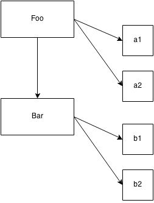

# “类”与对象的混合(Mixing Up "Class" Objects)

根据过往的经验，我们很容易将“面向对象”(object orientation)的思想，关联到“面向类”(class orientation)上 —— 实例化(instantiation)、继承(inheritance)、多态(polymorphism) —— 但这些面向类的思想 *映射(map)* 在JS的对象机制中时，并不太自然。

## 类的理论(Class Theory)
“类/继承” 描述某种代码的组织和架构形态 —— 是一种在软件世界中模拟现实世界面临的实际的问题的一种方法。

面向对象/类的编程语言强调的是根据数据的不同的类型和特性，将数据从本质上和行为关联起来，以此将数据和行为合理的打包、封装在一起。在计算机科学领域，这被称为“数据结构”(data structures)。

例如，有一系列用来代表单词或词组的 字符(characters) 通常被称为 “字符串”(string)。这些 字符(characters) 就是数据，但你关心的只是如何操作这些数据，而不是数据本身。因此一些操作数据(字符)的行为，都被设计成 `String` 类的方法。而所有给定的字符串，都是这个类的实例，这也意味着它不仅包含了字符数据，也能执行相应的方法功能。

类也是一种对数据结构的分类 —— 将任何一种数据结构看做是一个更通用定义下，某个特定的变体。举个例子，汽车类可以被看成是交通工具类的一个特殊的实现。而交通工具类的定义应该具有推进器、载人能力等功能 —— 它应该是其他交通工具(飞机、轮船、火车)所共同具有的特征。

而一旦定义好了交通工具类，汽车类则只需要继承它，而不需要再重复的去定义诸如 “载人能力” 等功能。而实例化的汽车则只需要譬如唯一的 VIN 码之类的数据即可。

另一个类的关键概念是 多态，它描述的是子类能够重写父类的同名方法。实际上，相对的多态能够既让我们使用基本的父类行为的同时，还能自定义子类的其他行为。但在JS代码中实现这些功能，可能会让你迷惑，且又让代码变得脆弱。

### “类”的设计模式("Class" Design Pattern)
你或许从未想过将 “类” 做为一种设计模式，毕竟我们通常讨论的都是面向对象的设计模式，譬如 “迭代器模式”、“观察者模式”、“工厂模式”、“单例模式”……大多数的假设都认为 面向对象的类 是实现高级设计模式的基础，就好像面向对象是所有代码的基础一样。

面向过程编程 同样也是一种编程的范式 —— 没有高级的抽象，只是由调用函数的过程所组成 —— 你可能会认为 类 是解决这些 “意大利面条代码(spaghetti code)” 的良方。你可能知道 函数式编程，明白 类 只是常见的程序设计的一种，但对于其他人来讲，这可能是你问自己的一次好机会：类是否真的是所有代码的基础？还是它只是一种的可选抽象模式。

有些编程语言没得选，比如Java —— everything's a class。另一些语言，比如 C++ 和 PHP，同时提供了面向过程和面向对象的语法，从而让开发者能够选择合适的模式。

### JS中的类(Javascript "Classes")
JS中有很多关于类的语法，比如 `new` 和 `instanceof`，并且在ES6中还新增了关键字 `class` 等。但这就意味着JS中真正存在类么？简单明了 —— 没有。

JS仅仅通过一系列的形似 “类” 的语法，来满足进行 “类” 设计的需求，但并没有真正支持 “类” 的机制 —— 语法糖和广泛使用的 “类” 库好像隐藏了这一切，但在底层，无论是构建“类”还是操作“类”的机制都和其他拥有“类”的语言完全不同。

## 类的机制(Class Mechanics)
在大多数 面向类(class-oriented) 的语言中，栈(stack) 这种数据结构都应是标准供应的。比如一个 `Stack` 类，应该具有一组内置的变量用于存储数据，同时也有一组用于和数据交互的公开的方法。

在这些语言中，你不需要直接和 `Stack` 类交互。`Stack` 类只是一个对于 栈(stack) 这种数据结构应该做什么的抽象，它自身并不是一个 栈。在你需要操作具体的数据结构时，你应该实例化这个 `Stack` 类。

### 建筑(Building)
对于 “类(class)” 和 “实例(instance)” 的隐喻是来自于建筑学。

一个建筑师会罗列出一个建筑物的所有特征：多宽、多高、有多少窗户、在什么位置，甚至是墙和屋顶的材料类型……但他不会关心建筑将建在什么地方，也不会在意会有多少建筑会根据这个蓝图所创建。他甚至不用考虑建筑内部的具体内容 —— 家具、墙纸、天花板…… —— 只会关心它们将被包含在什么类型的建筑结构中。

建筑师绘制的建筑蓝图只是一个建筑施工的计划，它并不包含真实的建筑。我们需要建筑工人去完成这个施工计划，建筑工会根据蓝图去施工。从实际的角度出发，建筑工是将施工计划中建筑的特性逐一复制到实体的建筑中去。

一旦建筑施工完成，建筑就是施工蓝图的一个具体的实例化，一个从本质上来看完美的副本。接下去，建筑工会继续挪到下一处空地，把相同的事情再做一遍，创造出另外一个副本。

实体建筑和施工蓝图之间的关系是间接的。你可以通过施工蓝图去理解建筑的具体构造，而不是直接去检查建筑自身的某个部位。但如果你想打开一扇门，那么你必须进入这个建筑中去 —— 建筑蓝图只是在纸上画了一些线段，代表门应该在什么地方。

“类” 就是建筑蓝图。想要获得一个能实际交互的对象，我们必须基于类去实例化。“施工”的产出就是一个对象，通常称为“实例” —— 我们能直接在上面调用方法，也能从中获取任何公开的属性。

**这个对象就是 具有类所描绘的所有的特征的 副本。**

就像你不会到一个建筑里面去搜寻蓝图，然后将它的副本裱起来，并挂在墙上一样，你通常不会用一个实例化的对象去直接操作一个类。但判断这个对象是由哪一个类实例化而来则是常见的需求。

考虑类和实例的直接关系，而不是实例对象和类来源的间接关系。**一个类实例化成一个对象是通过复制操作。** 比如下图，箭头方法代表了复制操作的产生，概念上和物理上都有：



### 构造函数(Constructor)
类的实例的构建通常是由类中一个特殊的方法完成，这个方法一般和类同名，被成为构造函数(constructor)，它的工作就是显示地初始化实例所需要的数据。

比如👇下面的伪代码：
```js
class CoolGuy {
  specialTrick = 'nothing'

  CoolGuy (trick) {
    specialTrick = trick
  }

  showOff () {
    output('Here is my trick:' + specialTrick)
  }
}
```

实例化一个 `CoolGuy`，只需要调用类的构造函数：

```js
Joe = new CoolGuy('jumping rope')

Joe.showOff()
```

`CoolGuy` 类在使用 `new CoolGuy(..)` 会直接调用构造函数 `CoolGuy ()`，随后会返回一个实例化的对象，在这个对象上能调用 `showOff()` 输出某个 `CoolGuy` 的特殊技能。

*跳绳显然让 Joe 变得很酷*

构造函数属于类，通常和类同名。`new` 关键字能让编程语言的引擎知道你想要构造出一个类的实例对象。

## 类的继承(Class Inheritance)
在面向类的语言中，无论是定义一个用于实例化的类，亦或定义一个继承于其他类的类，都是可以的。一般来讲，被继承的类称为 “父类”，继承它的类被称为 “子类”。这种称谓来自于现实世界的抽象，但显然这样的抽象有点夸张了 —— 当父母有一个亲生的孩子时，他们孩子的基因复制于他们。显然在大多数生物遗传系统中，父母双方的基因会混合，但处于比喻的目的，我们假设只有一个父母。

一旦孩子被“生下来”后，他/她 就会和父母彻底分离，虽然孩子会被父母严重影响，但出生后他就是一个独立的个体了 —— 即便孩子的头发是红色的，也不会意味着父母的头发也会变成红色。

类似的，一旦子类被定义后，它会完全和父类分离。子类会包含从父类拷贝来的初始化行为和属性，随后这些行为和属性都能被重写，甚至定义新的行为和属性。关键点在于我们谈论的父类和子类不是实际存在的物理东西。用父母和孩子的比喻会造成一些困惑，实际上我们应该将父类比喻成父母的DNA，将子类比喻成孩子的DNA，而后用一组DNA制造(实例化)出一个“有血有肉的人”。

理解类的继承最经典的例子来源于用类来实例化不同类型的汽车(当然是伪代码 pseudo-code)：

```js
class Vehicle {
  engines = 1

  ignition () {
    output('点火！')
  }

  drive () {
    ignition()
    output('老司机开车了！')
  }
}

class Car extends Vehicle {
  wheels = 4

  drive () {
    super.drive()
    output('油门到底！')
  }
}

class SpeedBoat extends Vehicle {
  engines = 2

	ignition() {
		output('点火！', engines)
	}

	pilot() {
		super.drive()
		output( '水手开船了!' )
	}
}
```

**Ｎote**：方便起见，👆上面的代码省略了构造函数。

我们定义了一个 `Vehicle` 的类，它定义了引擎数量，一个点火启动的方法，一个行驶的方法 —— 但你不会用这个类来初始化一个实例交通工具，它只是一个抽象的概念。因此，我们定义了两个特殊的交通工具 —— `Car` 和 `SpeedBoat`，他们都继承自 `Vehicle`，但都自己重写了部分行为和属性。比如一辆汽车需要四个轮子；而快船需要两台引擎，也因此它的点火启动启动行为也需要重新定义。

###　多态(Polymorphism)