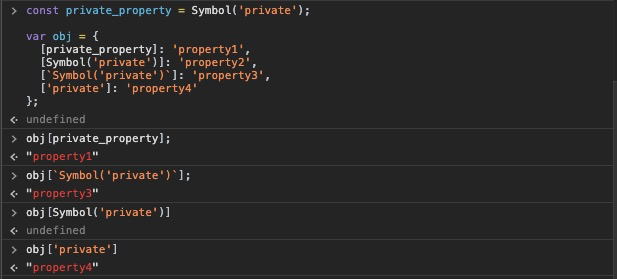

# 对象(Objects)
前面两节的内容主要解释了 `this` 是如何根据规则，指向某个对象的 *上下文* 的。但对象到底是什么？为什么需要指向它呢？

## 语法(Syntax)
JS中创建 **对象(Objects)** 源于两种形式：*字面量声明(literal declarative)创建* 和 *构造(constructed)创建*。

字面量创建：
```js
var obj = {
  key: 'value'
};
```

构造函数创建：
```js
var obj = new Object();
obj.key = 'value';
```

两种模式创建出的对象都一样，唯一的区别在于 字面量创建 可以一次性的添加多个 *键值对(key/value pairs)*，而 构造函数创建 模式只能创建好对象后，再一个个的往里面添加。

## 类型(Type)
对象在JS这门语言中的重要性不言而喻，它是JS主要的语言类型中的一种：
- `string`

- `number`

- `boolean`

- `null`

- `undefined`

- `object`

`string`、`number`、`boolean`、`null` 和 `undefined` 都属于 简单的原始类型，特别要强调的是 `null`，在使用 `typeof null` 判断其类型时，得到的结果是 `"object"` —— 这是一个历史遗留的bug，实际上，`null` 是原始类型的值。

这句话：**“在JS中万事万物皆对象”** —— **显然是不对的**。

相反，有几种特殊的对象子类型，我们通常将它们视为是复杂类型。`function` 就是其中之一，它不仅是JS中的 *一等公民(first class)*，你可以像操作普通对象一样操作它；并且，它还被赋予了 callable behavior。

数组也是对象子类型之一。它能够让数据更轻量化的组合在一起。

## 内置对象(Built-in Objects)
下面几种 内置的对象子类型(也称为包装对象) 有一些和 原始类型 有密切的关联：
- `String`

- `Number`

- `Boolean`

- `Object`

- `Function`

- `Array`

- `Date`

- `RegExp`

- `Error`

在某些语言中，上述的这些类型会被定义为某种 类(class)，比如Java的 `String` 类。但在JS中，它们的本质只是 内置的函数(built-in function)，加上关键字 `new` 来调用它们构造出一个对象的子类型，例如：

```js
var str_primitive = 'string';
typeof str_primitive; // "string"
str_primitive instanceof String; // false

var str_object = new String('string');
typeof str_object; // "object"
str_object instanceof String; // true

Object.prototype.toString.call(str_object); // "[object String]"
```

👆由 `new String('string');` 构造出的 `str_object` 显然是 `object` 的子类型。而由字面量直接创建的 `str_primitive` 是货真价实的 `string` 原始类型。

想对 `str_primitive` 进行一些字符串的操作，比如获取其长度、截取某个字符等，需要将其转换成对象类型的 `String`。所幸的是，这些冗余的工作被JS自动完成了，而且相当的智能 —— 这也意味着用 `String` 构造函数创建一个字符串显得不仅多余，而且还不方便阅读和维护。**只有当你需要用到额外的选项时，才考虑使用构造函数的形式去创建。**

```js
var str_primitive = 'string';

str_primitive.length; // 6

str_primitive.charAt(3); // "i"
```

同样的规律也适用于 `Number`、`Boolean` 对象子类型中。

`null` 和 `undefined` 没有构造函数为其创建包装对象，只有字面量创建的方式；而 `Date` 只能通过构造函数创建，没有字面量创建的方式。

`Object`、`Array`、`Function` 和 `RegExp` 等，无论是通过字面量的形式还是构造函数的形式，创建出来的都是对象的子类型。

`Error` 对象很少显示的在代码中创建，一般在程序运行出错时会自动创建。

## 内容(Contents)
组成对象的各种类型的值，都被保存在一个称为 属性(properties) 的地方中。虽然看似这些值都应该是存储在这个对象里，但在实际操作的时候并非都如此 —— 有时候属性保存的只是一个 指针(pointer)，这个指针指向的才是实际值存储的地方。

```js
var obj = {
  a: 2
}

obj.a; // 2

obj['a']; // 2
```

点运算符 `.` 和 中括号操作符 `[]` 都能从对象中获取属性 `a` 保存的实际的值。在某些情况下，它们是可互换的。它们的区别之一是 `.` 的后面只能接受合法的 标识符(Identifier)，而 `[]` 能容纳一切符合 UTF-8/unicode 字符集范畴内的字符串：

```js
var obj = {
  'property-a': 56
};

obj['property-a']; // 56

// obj.property-a; // ReferenceError
```

另外一个区别是 `[]` 能够接受一个变量来动态的改变要访问的属性：

```js
var idx = 'property_a';
var obj = {
  property_a: 2,
  property_b: 3
};

obj[idx]; // 2

idx = 'property_b';

obj[idx]; // 3
```

你还能利用 ES6 模板字符串的功能更优雅完成👆上述操作：
```js
var idx = 'a';
var obj = {
  property_a: 2,
  property_b: 3
};

obj[`property_${idx}`]; // 2

idx = 'b';

obj[`property_${idx}`]; // 3
```

在对象中，属性名的类型是 `string`，就算你用了别的类型的值来作为属性名，最终也会被强行转换成字符串，哪怕是使用 `number `类型的值，也无法避免。这一点千万别合数组搞混淆了：

```js
var obj = {};

obj[true] = 'foo';
obj[3] = 'bar';
obj[obj] = 'baz';

obj[true]; // 'foo'
obj['true']; // 'foo'

obj[3]; // 'bar'
obj['3']; // 'bar'

obj[obj]; // 'baz'
obj['[object Object]']; // 'baz'
```

### 计算属性名(Computed Property Name)
针对获取对象的属性值，我们能利用 `[]` 传入一个变量，来动态的改变属性名，从而动态的获取不同的属性值。那如果想要动态的描述一个对象的属性名呢？ES6 新增了一个叫做 *计算属性名(computed property names)* 的新特性，同样使用了中括号 `[]` 运算符，将其放在对象键名的位置上：

```js
var prefix = 'prefix_';

var obj = {
  [prefix + 'bar']: 'hello',
  [prefix + 'baz']: 'world'
};

obj[`${prefix}bar`]; // "hello"
obj[`${prefix}baz`]; // "world"
```

ES6 中新增的 `Symbol` 配合使用计算属性名，是一种新用法 —— 简单来讲，`Symbol` 是一个新增加的原始类型(从技术角度说依然是 `string`)，并且它是一个唯一的不重复的值，因此常被用于作为对象的私有属性名，如此一来保证不会有其他的属性覆盖掉私有属性：
```js
const private_property = Symbol('private');

var obj = {
  [private_property]: 'property1',
  [Symbol('private')]: 'property2',
  [`Symbol('private')`]: 'property3',
  ['private']: 'property4'
};


obj[private_property]; // "property1"

obj[`Symbol('private')`]; // "property3"

obj[Symbol('private')]; // undefined

obj['private']; // "property4"
```



### 属性 vs. 方法(Property vs. Method)
有些程序员喜欢纠结当对象的一个属性值是函数时，应该称它为方法。若要区分 *方法获取(method access)* 和 *属性获取(property access)*，听上去总感觉怪怪的 —— 特别是当JS的规范也做了同样的区分，interestingly。