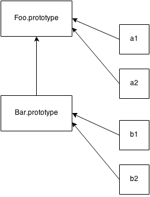

# 原型(Prototypes)
无论是之前提到的 `mixin` 还是 `[[Prototype]]`，本质上都是为了模拟传统面向对象语言中类的实现罢了。

## `[[Prototype]]`
JS中的大部分的对象都有一个内置的属性，在规范中注明为 `[[Prototype]]`，这是一个用来引用其他对象的属性。

```js
var myObj = {
  a: 2
};

myObj.a; // 2
```

在上面👆的代码块中，`myObj.a;` 激活了 `[[Get]]` 运算，它做的第一步事情就是检测 `a` 属性是否存在于 `myObj` 上，如果有，直接返回它。但如果 `myObj` 里没有属性 `a`，那么 `[[Get]]` 运算就会往 原型链 `[[Prototype]]` 中找：

```js
var otherObj = Object.create(myObj);

otherObj.a; // 2
```

`Object.create(…)` 这个方法可以暂时将它理解为创建一个对象，并且将它的 `[[Prototype]]` 关联到参数对象上。因此，`otherObj` 的 `[[Prototype]]` 就关联到了 `myObj` 上，所以即便 `otherObj` 中并没有属性 `a`，但 `[Get]]` 运算通过 `[[Prototype]]` 找到了 `myObj`，而后返回了 `myObj.a` 的值。

`[Get]]` 运算会一层层的查找每个对象的 `[[Prototype]]`，如果最终没有找到，则会返回 `undefined`。

`for…in` 循环和 `in` 操作符同样借用了 原型链(`[[Prototype]]` chain) 的机制，前者会遍历原型链上所有 可枚举(enumerable) 的属性，后者则会挨个检查 原型链 上是否存在某个属性。

```js
for (k in otherObj) {
  console.log('found: ', k);
}
// found:  a

'a' in otherObj; // true
```

### `Object.prototype`
`Object.prototype` 是原型链的尽头，这个对象包含了很多我们常见的方法，比如 `.toString()`、`.valueOf()`、`hasOwnProperty()` 等。通过原型链，常规的普通对象就能调用这些 `Object.prototype` 里面内置的方法。其中有一个 `isPrototypeOf(…)` 的方法接下去会重点谈一谈。

#### 设置/遮盖 属性(Setting & Shadowing Properties)
在原型链中，设置一个属性会经历比你想象的多得多的事情，比如👇看似简单的第一个赋值语句：

```js
myObj.foo = 'foo';
```

如果 `myObj` 已经有一个属性为 `foo`，那么这个赋值语句和期望一样，仅仅简单的将 `foo` 的属性值更变。

如果 `myObj` 没有 `foo` 属性，那么接下去就会遍历原型链(和 `[[Get]]` 运算类似)：
  - 这时候如果 `foo` 不存在于任何一层的原型链中，那么 `foo` 属性就会被直接加到 `myObj` 里；
  
  - 但如果 `foo` 属性在某一层原型链中存在，那情况就有些复杂了：
      1. 如果在原型链中的 `foo` 被设置为 **只读** (`writable: false`)，那么这次赋值操作就会失败，并且若是在在 严格模式 中，还会抛出错误；

      2. 如果在原型链中的 `foo` 定义了 setter 方法，那么这个 setter 方法在每次赋值语句中都会被调用，并且 `foo` 不会被加到 `myObj` 中，同时 setter 也没办被重新定义；

      3. 若原型链上只是一个常规的 `foo`，那么 `foo` 会被加到 `myObj` 上，作为 **遮盖的属性(shadowed property)**。


如果 `foo` 属性在 `myObj` 和原型链中同时存在，这时候就被称为 *遮盖(shadowing)* —— 在 `myObj` 上的 `foo` 会 遮盖 掉原型链上其余所有的 `foo` 属性，因为原型链查找永远只会找到最底层的 `foo`。

当然，`Object.defineProperty(…)` 能够成功绕开上面的 #1 和 #2 两条限制，直接把 `foo` 添加到 `myObj` 上。

对于 **只读** 属性没法办赋值成功的原因，是因为 JS 想加强它“拥有” 类的继承 的幻觉 —— 如果你从一个类中继承了某个属性，它是只读的，那么在子类中，继承而来的这个属性同样也应该是只读的。但如果你了解了JS继承的本质，就会觉得 `myObj` 无法设置 `foo` 属性，仅仅是因为某个其他的对象将 `foo` 属性设置为了只读，你就会感到十分的别扭。而 `=` 赋值操作符不起作用，但是 `Object.defineProperty(…)` 又不受限制的首尾不一致，更是让人啼笑皆非。

遮盖往往会在意料之外悄悄地发生：

```js
var myObj = {
  a: 2
};

var otherObj = Object.create(myObj);

myObj.a; // 2
otherObj.a; // 2
myObj.hasOwnProperty('a'); // true
otherObj.hasOwnProperty('a'); // false

otherObj.a++;
myObj.a; // 2
otherObj.a; // 3

otherObj.hasOwnProperty('a'); // true
```

从道理来讲，`otherObj.a++;` 语句的执行应该是先从原型链上找到 `myObj` 上的 `a`，而后对其进行 `++` 操作。但实际上 `otherObj.a++;` 等价于 `otherObj.a = otherObj.a + 1`，因此若你想改变 `myObj.a` 的值时，只能用 `myObj.a++;`。

## “类”("Class")
开始这一节之前，我们先问一个问题：对象关联到另一个对象到底有什么用？为了回答这个问题，我们先得明白 `[[Prototype]]` 到底是什么以及如何使用它，但在这之前，还得先搞懂它不是什么。

在 JS 中，根本没有所谓的“类”，其底层只是对象。事实上，JS 在市面上众多流行的语言中是唯一一个能真正配得上 “面向对象” 这个标签的语言。

**There's just the object.**

### “类”函数("Class" Functions)
JS 中，“类”的实现都离不开函数：所有的函数都有一个公开的，且不可遍历的属性叫做 `prototype`，它是一个任意的(arbitrary)对象。

无论我们怎样叫它(`prototype`)，这个对象到底是什么呢？简单来讲，所有通过 `new` 关键字创建的“实例”，都会自动关联(`Foo.prototype`)上这个对象：

```js
function Foo () {}

var a = new Foo();

Object.getPrototype(a) === Foo.prototpye; // true
```

👆当调用 `new Foo()` 创建出“实例” `a` 时，其内部的 `[[Prototype]]` 就自动关联到了 `Foo.prototype`。

仔细思考上面的行为到底意味着什么 —— 在面向类的语言中，将一个类实例化的过程，一定会伴随着复制拷贝的行为，但是在 JS 中，并没有发生这样的事情。当然你能创建出多个对象都同时关联到某一个对象上，但那并不是赋值拷贝，这些对象彼此间并没有独立分开，相反是关联到一块儿去了。

`new Foo()` 返回的结果是一个新的对象，而这个新对象内置的 `[[Prototype]]` 关联到了 `Foo.prototype` 上。事实上，`new Foo()` 明面上做的事情并没有 “关联(link)” 这个动作，这是意外的副作用，它采用了一种迂回的方式帮我们实现了我们的要求：**创建一个新对象并关联到其他对象**。

那么我们能直接做这件事而不是绕来绕去调用 `new` 来实现么？当然可以，这个英雄就是 `Object.create(…)`。

#### 名字真的有那么重要么？！(What' in the name)
上一章中我们看见过类似的图：



👆唯一的区别是箭头的方向反过来了 —— 这当然是因为JS中类的继承和实例化并没有真正进行赋值拷贝的动作，而仅仅是在不同对象间，通过 `[[Prototype]]` 建立了连接。因而箭头的方向指向的是关联到的对象。

这样的机制常常被称为 “原型继承(prototypal inheritance)”，理解成经典的 “类继承(classical inheritance)” 的动态版。这样的称谓试图让我们将其理解成常见的 类 和 继承 中的一种，但实际上却会让我们扭曲其底层真正的实现。

在编程世界中，“继承” 这个概念有很明确的定义(详见前一章节)，而自从在其前面加上 “原型” 二字，但实际上执行的截然不同的行为时，一晃已经二十几年时间了。这就好比我们一手拿着橙子，一手拿着苹果，非得说苹果是 “红色的橙子” 一样荒谬 —— 无论给这个苹果贴上什么标签，也不能改变苹果和橙子有着本质的区别，而非仅仅是颜色上不一致。

对于JS而言，根本不应该使用 “继承” 这个字眼，更为贴切的说法是 “代理(Delegation)” —— 两个对象通过原型对象关联起来，其中一个对象能够代理另外一个对象上的属性、方法。

另一个比较常见的术语是 “差异继承(differential inheritance)”，这样的叫法是认为我们当描述一个对象的行为时，是基于一个通用的对象，而后在其基础上做差异化的定制。但其本质上还是在假设你的 思维模式(mental model) 比 实际的发生(physically happening) 更为重要 —— 因为在本质上并没有发生复制拷贝的行为。

### “构造函数”("Constructor")