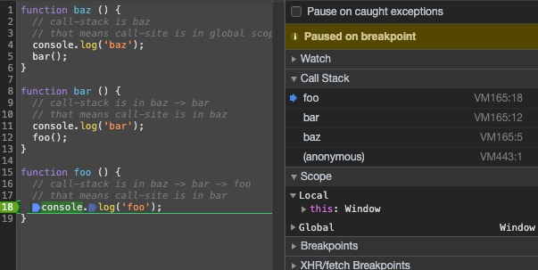

# `this` 看上去是那么回事了！(`this` All Makes Sense Now!)
之前提及 `this` 的绑定取决于函数调用时的调用条件，即函数如何被调用 —— **调用点(call-site)**。

## 调用点(Call-site)
所谓 *调用点(call-site)*，即代码中函数调用的位置(区别函数声明的位置)。但仅仅通过 *定位函数的调用位置* 来找到 *调用点* 并不那么有效，因为有些书写代码的模式会将其掩盖起来。

另一个重要的概念是 *调用栈(call-stack)* —— 当前函数 *执行时* 的已调用的栈。

👇 *调用点* 和 *调用栈*：
```js
function baz () {
  // call-stack is baz
  // that means call-site is in global scope
  console.log('baz');
  bar();
}

function bar () {
  // call-stack is in baz -> bar
  // that means call-site is in baz
  console.log('bar');
  foo();
}

function foo () {
  // call-stack is in baz -> bar -> foo
  // that means call-site is in bar
  console.log('foo');
}

baz(); // the bar call-site
```

从 *调用栈* 中分析出 *调用点* 是为了获取 `this` 的绑定，你可以使用浏览器自带的debugger工具，或者直接在代码里插入 `debugger`，来在 `foo` 函数的位置打断点，而后在可视化的图形界面中查看👆这段代码真实的调用栈(右侧第二行的Call Stack)：



## 规定，不是乌龟的屁股(Nothing But Rules)
想要知道 `this` 的绑定指向，我们必须先查看 *调用点*，并根据 **4** 个既定的规则来知晓 `this` 的真实指向。

### 默认绑定规则(Default Binding)
第一个场景是我们最为熟知的，即 *单独地调用某个函数(standalone function invocation)*。你可以把这个规则理解成其他绑定规则都没生效时，对于 `this` 绑定的 缺省/默认规则。

```js
function foo () {
  console.log(this.a);
}

var a = 2;

foo(); // 2
```

👆 全局的变量声明 `var a = 2;` 实际上同等于在 *全局对象(global-object)* 中加入了一个属性值 `a` —— 它们不是互为复制品，它们就是彼此，它们是一个硬币的两面，区别仅在于看问题的角度不同而已。

紧接着，我们调用函数 `foo` 而后执行其中的代码块 `console.log(this.a);` 获取到了变量 `a` 的值并将结果打印在控制台上。为什么 `this.a` 能够获取变量 `a` 的值？ —— 我们先查看 *调用点(call-site)*，发现对于函数 `foo` 是 *单独调用* 的，则可以确认应用的是默认绑定规则，因此这时候的 `this` 绑定的是全局对象。

但如果，我们使用了 *严格模式* —— `"use strict";`，`this` 的默认绑定的 *全局对象* 则会被替换成 `undefined`。

```js
function foo () {
  "use strict";

  console.log(this.a);
}

var a = 2;

foo(); // TypeError
```

有个重要的细节点：`this` 的绑定规则虽然基于 *调用点*，全局对象也只会在默认绑定规则且没有运行在 *严格模式* 才会绑定到 `this` 上。但在 *调用点* 上声明的 *严格模式*，并不能决定在这个点上调用的函数是否都遵循 *严格模式*：

```js
function foo () {
  console.log(this.a);
}

var a = 2;

(function () {
  "use strict";

  foo(); // 2
})();
```

### 隐式绑定规则(Implicit Binding)
