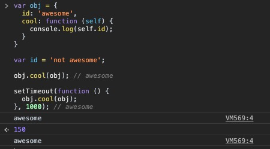

# 附录C：词法-this(Lexical-this)
ES6中，新增了一种叫做 *箭头函数(arrow function)* 的函数声明方式：
```js
var foo = a => {
  console.log(a);
};

foo(2); // 2
```

👆 `=>` 被称为 *粗体箭头(fat arrow)*，通常被认为是替代冗长的关键字 `function` 的缩写。但是显然有一些比节省键盘敲击次数更重要的事 —— 解决 `this` 的问题：

```js
var obj = {
  id: 'awesome',
  cool: function () {
    console.log(this.id);
  }
}

var id = 'not awesome';

obj.cool(); // awesome

setTimeout(obj.cool, 1000); // not awesome
```


👆在 `setTimeout` 里面执行关于 `obj.cool` 的回调函数时，发现 `this.id` 获取的值是全局作用域中 `var id` 的值；产生这个问题的根源是在回调函数中丢失了对于 `this` 的绑定。

想要解决这个问题，通常的做法是利用词法作用域的特性，将 `this` 用变量/参数 `self` 来代替：

```js
var obj = {
  id: 'awesome',
  cool: function (self) {
    console.log(self.id);
  }
}

var id = 'not awesome';

obj.cool(obj); // awesome

setTimeout(function () {
  obj.cool(obj);
}, 1000); // awesome
```

