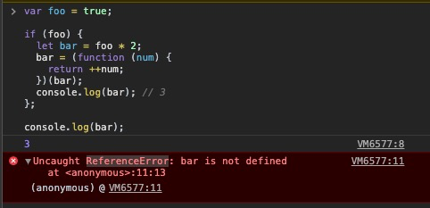

# 函数和块级作用域(Function vs. Block Scope)
之前提到过，JS中除了全局作用域之外，还有由函数创建的局部作用域，并且这些作用域之间还能相互嵌套。那么，除了函数之外，是否还有其他机制能够创建作用域呢？

## 函数的作用域(Scope From Function)
```javascript
function foo (a) {
  var b = 2;

  function bar () {};

  var c = 3;
}
```
👆无论是参数 `a`，变量`b`、`c` 还是函数 `bar`，它们都属于函数 `foo` 创建的作用域中。并且函数 `bar` 也创建了属于自己的作用域。如果想在全局作用域中访问这几个标识符，就会产生 `ReferenceError` 的错误：
```javascript
bar();

console.log(a, b, c);
```


当然，在 `foo` 和 `bar` 内的作用域，都是能够访问这些标识符的。

## 把代码藏在作用域中(Hiding In Plain Scope)
由函数创建的局部作用域有一个妙用：将任意的代码块放入其中后，能有效的 *"隐藏"* 它们。

软件设计中有一项 *最小特权原则(Principle of Least Privilege)*，又称为 *最小权利/暴露(Least Authority/Exposure)* —— 你应该只暴露最需要的 *API*，而 *隐藏* 所有的其他细节。

在JS中，如果你将所有的变量和函数都暴露在全局作用域下，那么不仅违背了这一原则，并且还会让你代码质量变得很差！比如👇的代码：
```javascript
function foo (a) {
  b = b + bar (a * 2);
  console.log(b * 3);
};

function bar (a) {
  return a - 1;
};

var b = 2;
foo(2); //15
```

变量 `b` 和函数 `bar` 暴露在外部，任何对它们的修改都可能会导致函数 `foo` 产出的结果变化；正确的做法是把暴露在外面的变量和函数都放到函数 `foo` 的内部，如此一来 `foo` 所产生的结果不会受到潜在影响：
```javascript
function foo (a) {
  var b = 2;
  function bar (c) {
    return c - 1;
  };

  b = b + bar (a * 2);
  console.log(b * 3);
};

foo(2); //15
```

### 避免冲突(Collision Avoidance)
*隐藏* 变量的另一个好处是能够避免由于使用了相同的变量名而产生意外的冲突。
```javascript
function foo () {
  function bar (a) {
    i = 3;
    console.log(a + 1);
  };

  for (var i = 0; i < 10; i++) {
    bar(i * 2);
  };
};

foo();
```
👆函数 `bar` 能够访问在 `for` 循环模块中声明的变量 `i`，并且对它重新赋值；这就会导致一个 *无限的死循环(infinite loop)* —— 无论 `for` 循环进行到哪一步，其内部调用的 `bar` 都会重新赋值 `i = 3;`，因此永远也不能满足 `i < 10` 的终止循环的条件。

#### 全局命名空间(Global "Namespaces")
很多第三方的库都使用了这种模式，即在全局作用域，定义一个有独特的变量名的对象，然后将所有的功能都作为这个对象的属性，最后只对外暴露这个对象：
```javascript
var someLibrary = {
  label: 'xxx',
  doSomething: function () {
    //...
  },
  doAnotherThing: function () {
    //...
  }
};
```

#### 模块管理(Module Management)
另一种避免标识符冲突的办法是使用 *模块(Module)* 的机制。

使用这种机制，你的库不会添加任何的标识符到全局作用域中，而是会被添加到另一个独立的作用域(能被全局作用域访问)中。在这个作用域中，会有一系列的规则保证你的标识符被保存在一个私有的作用域中，并且不会受到标识符名称冲突的影响。

## 函数即作用域(Functions As Scope)
定义一个 *命名函数(named-function)* 作为局部作用域保存私有属性和状态，确实能解决一些问题。但这种方式依然有不足的地方 —— 为了调用这个作用域，还要定义一个标识符名称，实际上也造成了全局变量的污染，比如上例中的 `foo`。如果能定义一个不会造成标识符污染的函数，并且自动执行它，这个问题就能得到解决：
```javascript
var a = 2;
(function foo () {
  var a = 3;
  console.log(a); // 3
  console.log(typeof foo); // 'function'
})();

console.log(a); // 2
console.log(foo); // ReferenceError
```

👆首先值得注意的是，`(function foo…` 是作为 *函数表达式(function-expression)* 而存在的一种形式，与之相对的是 `function foo…` 这样的 *函数声明式*。

**Note**: 区分 *函数表达式* 和 *函数声明式* 的简单办法就是看 `function` 出现的位置，如果 `function` 出现在第一个，就属于是 *函数声明式*，否则就是 *函数表达式*。

其次，`foo` 在外部作用域是无法被访问到的，而在表达式的内部作用域是能被访问的，这避免了全局的标识符污染。


### 匿名和命名(Anonymous vs. Named)
最常见的使用匿名函数的例子就是在我们将函数作为回调参数的时候：
```javascript
setTimeout(function () {
  console.log('wait 1 second')
}, 1000)
```

函数表达式能够匿名，但函数声明式不能。虽然匿名函数表达式用起来很爽，甚至还有不少的工具库鼓励这种代码书写模式，但是匿名函数带来的缺点也不少：
1. 匿名函数在调用栈中没有有用的名称(anonymous)，这会导致debug的难度变大：
```javascript
(function () {
  throw new Error();
})();
```


2. 递归(recursion)、`arguments.callee`、事件绑定后的解绑操作、定时器的清除操作……都需要通过函数名引用函数自身，但显然匿名函数不具备这个功能；

3. 好的函数名，本身也为一个更可读、更易于维护的代码环境提供基础；而匿名函数显然只能通过别的方式，比如注释来提高代码的可读性。

*内联函数表达式(Inline function expression)* 是很有用的机制；即便是匿名函数带来的这些问题，也不能够影响它的江湖地位；而且社区中也有针对此的最佳实践：
```javascript
setTimeout(function timer () { // 函数名 timer
  console.log('wait 1 second')
}, 1000)
```

### 立即执行函数表达式(Invoking Function Expression Immediately)
```javascript
var a = 2;
(function () {
  var a = 3;
  console.log(a); // 3
})();

console.log(a); // 2
```

👆这就是 **IIFE(Immediately Invoking Function Expression)**，第一个括号 `()` 包裹了整个函数体，第二个括号可以看做是函数的参数容器，第三个括号则是用于执行函数。当然，**IIFE** 可以是匿名的，但是加上一个函数名的 **IIFE** 好处更多。

**IIFE** 的另一种使用方式就是执行一个函数，并传递参数：
```javascript
var a = 2;

(function IIFE (win) {
  var a = 3;
  console.log(a); // 3
  console.log(win.a); // 2
})(window);

console.log(a); // 2
```

👆上面的 **IIFE** 还能颠倒参数和执行函数的位置，这源于函数在JS中是一等公民的特性 —— 即函数能作为参数传递，也能作为值赋值给变量：
```javascript
var a = 2;
(function IIFE (fn) {
  fn(window)
})(function def (win) {
  var a = 3;
  console.log(a); // 3
  console.log(win.a); // 2
});
```

## 块级作用域(Blocks As Scopes)
虽说由函数创建局部作用域是JS中使用最为广泛的方式，但其他的方式，比如使用 *块* 来创建局部作用域，不仅更简单直接，而且还易于维护。

一个很常见的 *块级作用域* 来自 `for` 循环语句：
```javascript
for (var i = 0; i < 10; i++) {
  console.log(i);
}
```

我们在写 `for` 循环语句时，可能只是想声明一个变量 `i` 作为一个循环的控件，并在每次循环中操作这个变量，已实现对循环的掌控(继续或结束)。但我们可能忽略了这个变量 `i` 会被声明在当前的执行作用域中(全局或是局部)。

这就是所谓的 *块级作用域* —— 变量会被嵌入到离声明它尽可能局部和近的地方：
```javascript
var foo = true;

if (foo) {
  let bar = foo * 2;
  bar = (function (num) {
    return ++num;
  })(bar);
  console.log(bar); // 3
};

console.log(bar); // ReferenceError
```


**Note**: 👆上面使用了 `let`，这是 *ES6* 的新特性，稍后会提及。

### `with`
之前提及到的 `with` 能够动态的创建作用域，虽然这是一个很危险且不推荐的语法，但它的确能够在其语句的声明周期内，生成 *块级作用域*。

### `try/catch`
一个鲜为人知的块级作用域是在 `try/catch` 语句中的 `catch` 中：
```javascript
try {
  null();
} catch (err) {
  console.error('try catch:', err);
}

console.log(err); // ReferenceError
```


👆由此可见，`err` 只存在于 `catch` 语句中，外部是无法访问到的。除了在一些非常老旧的IE浏览器中不支持之外，这个在 *ES3* 中确定标准在绝大部分浏览器中都得到了很好的支持。


### `let`
*ES6* 中引入了关键字 `let`，这是除了 `var` 之外的另一种声明变量的方式。`let` 会让任何在块级作用域(通常是 `{…}`)中声明的变量都是局部变量：
```javascript
var a = true;

if (a) {
  let b = a * 1;
  console.log(b); // 2
};

console.log(b); //ReferenceError
```

