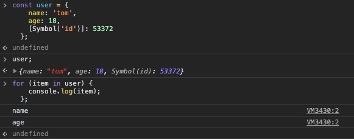

# 内建对象(Natives)

## 常用的Natives
1. String()
2. Number()
3. Boolean()
4. Array()
5. Object()
6. Function()
7. RegExp()
8. Date()
9. Error()
10. Symbol()

----

## 包装对象(Boxing Wrappers)
- 原始值不包含任何的属性和方法, 之所以能够有下面的行为, 是因为JS自动帮我们使用Natives做了一层 包装
  ```javascript
  'test'.length; // 4
  'test'.toUppercase(); // 'TEST'
  true.toString(); // 'true'
  ```

- 但如果在数字类型调用:
  ```javascript
  123.toString(); // SyntaxError

  var a = 123;
  a.toString(); // '123'
  ```
  

- 更高效的做法不是使用Native方法(包装对象)去创建原始值`var a = new Number(2);`，而是直接用字面量创建`var b = 2;`，因为大部分的浏览器已经对一些原始值常用的属性和方法进行了优化，而使用包装对象创建原始值会包含Native方法的context，性能开销更大，反而得不偿失

- 如果实在需要操作包装后的原始值，可以使用 `Object()` 方法而不是用new 关键字初始化一个实例, 否则意想不到的结果会等着你:
  ```javascript
  var a = new Boolean(false);
  var b = Boolean(false);
  if (!a) console.log('never run!');
  if (!b) console.log('run!');
  // 直接调用Object内建函数
  var c = Object(123);
  var d = Object('test');
  ```

- 如果想要将包装对象显示的转化成原始值，可以使用 `valueOf()` 方法
  ```javascript
  var a = new String('123');
  var b = new Number(123);
  var c = new Boolean(false);

  a.valueOf(); // '123'
  b.valueOf(); // 123
  c.valueOf(); // false
  ```

----

## Array(...)
### new Array(...); 和 Array(...);
- 两者都行为表现一致

- 只指定一个参数的时候，创建的是一个预填充的数据

- 传递一个以上的参数时，则将每个参数作为slot的值生成数组

### empty 和 undefined数组
- `empty[]` 稀疏数组 和 `undefined[]` 空数组
  ```javascript
  var a = Array(3);
  var b = [undefined, undefined, undefined];
  var c = [];
  c.length = 3;
  var d = [, , ,];

  // 出现下面情况的原因是因为稀疏数组的slot并不真实存在，因此map方法没有进行遍历
  a.map((v, k) => k); // [empty * 3]
  b.map((v, k) => k); // [0, 1, 2]
  c.map((v, k) => k); // [empty * 3]
  d.map((v, k) => k); // [empty * 3]

  // join方法的原理则是查找数组的length属性，如果length存在，即便是稀疏的slot，也会遍历到
  a.join('-'); // --
  b.join('-'); // --
  c.join('-'); // --
  d.join('-'); // --

  // for 循环... 正常
  ```

- 创建指定长度数组的奇淫巧技
  ```javascript
  // apply第二个参数接受一个数组或者类数组，{ length: 3 } 就是一个类数组对象，并作为参数被spreading out 到Array这个方法中；但是{ length: 3 }类数组的每项slot都为undefined，因此最终形成了Array(undefined, undefined, undefined);

  var e = Array.apply(null, { length: 3 }); // [undefined, undefined, undefined]
  ```

----

## Object(...) & Function(...) & RegExp(...)
- `new Object(...)` ---> 没有任何理由使用它而不用对象字面量，因为它不仅要求你一个一个添加对象属性，在性能上也没有对象字面量好

- `new Function(...)` ---> 允许你动态的创建函数，但别把它和eval(...)混淆，后者是应该避免使用的坑

- `new RegExp(...)` ---> 正则表达式字面量不仅在语法上，而且在性能上也优于正则构造函数(JS engine 会预编译和缓存正则字面量表达式)，但是正则构造函数可以动态创建正则，在这种case下非常有用

----

## Date(...) & Error(...)
- `Date()` 获取格式化后的时间日期字符串

- `Date.now()` 和 `new Date().getTime()` 获取当前时间戳

- `Error(...)` 和 `new Error(...)` 产生的行为都一致

- 内嵌的错误类型
  * EvalError(...)
  * RangeError(...)
  * ReferenceError(...)
  * SyntaxError(...)
  * TypeError(...)
  * URIError(...)

----

## Symbol(...)
- 是唯一一个Native 方法不能使用new 关键字的构造函数

- 使用`Object.getOwnPropertySymbols(...)` 能够获取对象上的symbol属性

- 通常的做法是 用**symbol** 指代 *特殊/私有* 属性，下面代码中的`Symbol('id')`就是私有属性，不能被`for in`循环遍历到
  ```javascript
  const user = {
    name: 'tom',
    age: 18,
    [Symbol('id')]: 53372
  };
  user; // {name: "tom", age: 18, Symbol(id): 53372}

  for (item in user) {
    console.log(item);
  };
  // name
  // age
  ```
  

----

## Native.prototype
- 大部分Native 的prototype 是一个对象，除了Function.prototype 和 Array.prototype之外
  ```javascript
  typeof Function.prototype; // function
  Function.prototype(); // undefined
  ```

  ```javascript
  Array.isArray( Array.prototype ) ; // true
  Array.prototype.push(1,2,3); // 3
  Array.prototype; // [1,2,3,...]
  Array.prototype.length; // 3
  ```

- 其他一些怪异的情况
  ```javascript
  RegExp.prototype.toString(); // '/(?:)/'
  ```