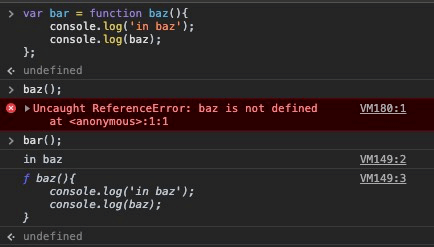
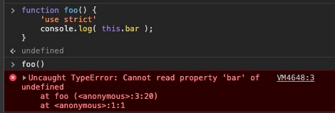

# 进入JavaScript(Into JavaScript)
这一章节的内容会对聚焦在JavaScript这门语言中一些特别东西，并且对此做一个大致的梳理过程，但是并不会深入其中。

深度探究JavaScript的起点，是从这里开始

## 值和类型(Values & Types)
JavaScript(后简称JS)，变量没有类型，只有值才有类型，下面是一些内置的类型：
- `string` - 字符串

- `number` - 数字

- `boolean` - 布尔值

- `null` 和 `undefined`

- `object` 对象类型

- `symbol`

JS 也内置了 `typeof` 运算符，能够以字符串的形式返回某个值的类型：
```javascript
var a;
typeof a; // "undefined"

a = 'test';
typeof a; // "string"

a = 2;
typeof a; // "number"

a = true;
typeof a; // "boolean"

a = null;
typeof a; // "object"

a = undefined;
typeof a; // "undefined"

a = {};
typeof a; // "object"

a = Symbol(1);
typeof a; // "symbol"
```

__Tips__: 👆注意上面的 `typeof a` 并不是询问变量 `a` 的类型，而是询问当前在变量 `a` 中的值是什么类型。

__Warning__：`typeof null` 返回的是一个 `"object"`，虽然这是一个 _bug_，但它经历了很长历史包袱，因此若是将其修复，甚至会导致更多更严重的问题。

`a = undefined` 是我们显示的给变量 `a` 赋值 `undefined`；在JS中，有以下几种能设置变量为 `undefined` 的方式：
- `var a;` —— 不设置任何值

- `a = undefined;` —— 显示的赋予`undefined`

- `var a = (function () {})()` —— 函数不返回任何值

- `void(undefined)` —— 使用 `void` 运算符

### 对象(Object)
对象是一个键值对的形式的集合，即由字符串类型的 *属性名*(properties)包含 *任意* 的复合值的集合：
```javascript
var obj = {
  a: "text",
  b: 22,
  c: false
};

obj.a; // "text"
obj.b; // 22
obj.c; // false

obj[a]; // "text"
obj[b]; // 22
obj[c]; // false
```

从对象中获取属性可以用 `.` 点运算符(dot notation) 或者 `[]` 括号运算符(bracket notation) —— 前者更常用也更方便阅读，后者在属性名含有 *特殊字符* 或者用 *变量* 时使用：
```javascript
var obj = {
  a: "text",
  b: 22,
  'test string': false
};
var b = 'a';

obj['test string']; // fasle
obj[b]; // "text"
obj['b']; // 22
```

#### 数组(Arrays)
数组是对象的一个子类型，但它的键是由数字类型的 *索引*(indexed) 组成的，并且内置了一个 `length` 的属性表示数组的长度：
```javascript
var arr = ["text", 22, false];

arr[0]; // "text"
arr[1]; // 22
arr[2]; // false
arr.length; // 3

typeof arr; // "object"
```

`length` 属性会自动根据数组的长度进行更新，但如果你自定义了非数字类型的属性名，那么新增的不会计入到 `length` 中；因此正常的使用数组的方式还是用数字类型的索引

#### 函数(Functions)
函数也是对象的一个子类型：
```javascript
function foo () {
  return 22;
}

foo.bar = 'text';

typeof foo; // "function"
typeof foo(); // "number"
typeof foo.bar; // "string"
```

虽然 `typeof foo;` 生成的结果是 `"function"`，然而函数依然可以像对象一样拥有属性，这也意味着函数是对象的一个子类型(subtype)

### 内置类型的方法(Built-In Type Methods)
内置(built-in)类型以及子(subtype)类型暴露出来的一些属性和方法十分有用：
```javascript
var a = 'text';
var b = 3.14159;

a.length; // 4
a.toUpperCase(); // "TEXT"
b.toFixed(4); // "3.1416"
```

👆`a.toUppercase()` 之所以能够这样被调用，在其底层有较为复杂的逻辑；简单讲，有一个 `String` 包装对象，通常称为内置对象(native)，与原始类型的 `string` 配对，在其原型对象`prototype`上，定义了这个叫做`toUpperCase` 的方法。当你像对象一样查询 `"text"` 的属性或者方法时，JS会自动帮我们 *包装(boxes)* 一层与之配对的对象(该例中就是 `String` 对象) —— 对于 `number` 类型的就是 `Number` 对象，`boolean` 类型的就是 `Boolean` 对象。

### 比较值(Comparing Values)
在JS中，有两种比较的类型：*相等(equality)* 和 *不相等(inequality)* 比较。无论比较的值是什么类型，比较的最终结果都是布尔值。

#### 类型转换(Coercion)
JS中有两种形式的类型转化：*显示的(explicit)* 和 *隐式的(implicit)* —— 前者是你能够明显在代码中看到的，后者是指在某些不注意的地方发生的副作用的操作产生的转换。

类型转换不是魔鬼，相反在很多地方它都很有用 —— 对于写出可读的、合理的、易于理解的代码有很大帮助：
```javascript
var a = "22";
// 显示转换 explicit
var b = Number(a);

a; // "22"
b; // 22
```

```javascript
var a = "22";
// 隐式转换 implicit
var b = a * 1;

a; // "22"
b; // 22
```

#### Turthy 和 Falsy
JS中的 `falsy` 的值：
- `""`

- `0`, `-0`, `NaN`

- `null`, `undefined`

- `false`

所有不在 `falsy` 列表中的值就是 `truthy`，比如：
- `"text"`

- `22`

- `true`

- `[ ]`、`[1, "2", 3]`

- `{ }`、`{ a: 22 }`

- `function foo () {}`

#### 相等(Equality)
记住四个相等运算操作符 `==`、`===`、`!=`、`!==`

`!` 非操作符意味着 *取反值(not equal)*

**Tips**：区别 `!= !==`(*non-equality*) 和 `>、>=、<、<=`(*inequality*)

`==` 和 `===` 的区别 *不是* 说前者只检测值是否相等，后者除了值之外还要检测类型是否相等，而是前者在比较的时候允许类型转换，后者不允许：
```javascript
var a = '22';
var b = 22;

a === b; //false
a == b; // true
```

对于👆的 `a == b`，到底是转换成了`"22" == "22"` 还是 `22 == 22` 呢？答案是后者。其转换过程比较复杂，详见[类型转换](../types%20%26%20grammar/coercion.md)一章

对于应该使用 `===` 从而避免 `==` 带来的困惑，一直以来都有很多争论，但是 `==` 确实是一个很有用的工具，你应该学习了解它的规则然后使用它，而不是全然否定掉它。这里有几个简单的规则：
- 如果值是`true` 或者 `false`，那么别使用`==`，用 `===` 代替

- 如果比较值是下面其中之一，别使用`==`，用 `===` 代替：
  - `0`

  - `""`

  - `[]`

- 其他情况下，使用 `==` 是安全可靠的，并且让你的代码更具有可读性

对于 `!=` 和 `!==` 的使用规则和相等比较基本类似，唯一的区别是取反。

需要注意的是，对于两个都是非原始类型的值的比较，`==` 和 `===` 的规则都是一样的，它们只会检查地址引用是否匹配，和它们本来的值无关：
```javascript
var a = [1,2,3];
var b = [1,2,3];
var c = '1,2,3';

a == c; // true
b == c; // true
a == b; // false
```

#### 不全等(Inequality)
`<`、`>`、`<=`、`>=` 是所谓的关系比较，比如常用的比较 *数字(number)* 的大小 —— `3 < 4`。

JS中的 *字符串(string)* 也能进行关系比较 —— 用字母顺序的规则(aka alphabetic like a dictionary)来进行比较。

如果既有 *数字(number)* 又有 *字符串(string)*，那会将字符串转换成数字后进行比较。

```javascript
var a = 22;
var b = '23';
var c = 'txt';

a < b; // true
a > b; // false
a == b; // false

a < c; // false
a > c; // false
a == c; // false
```

👆上面的 `var c = 'txt'` 在进行 *关系比较* 时会被转换成数字，但因为它不是 *类数字的字符串(numeric)*，因此会被转换成 `NaN` —— 该值不大于、小于或等于任何值，包括它自身：
```javascript
var a = NaN;

a == a; // false
```

---

## 变量(Variables)
在JS中，变量的名字有明确的规则：
- 必须以 `a`-`z`、`A`-`Z`、`$`、`_`开头

- 除去开头部分，数字`0`-`9`也能够被用于创建变量名

- _保留字(reserved word)_ 和 _关键字(keywords, `var`、`for`、`in`、`if`、`null`、`undefined`、`true`、`false`...)_ 不能被用于创建变量名

### 函数作用域(Function Scopes)
用 `var` 关键字声明的变量要么属于全局作用域，要么属于某个函数作用域。

#### 提升(Hoisting)
在任意一层的作用域中，无论 `var` 出现在哪里，这个 *声明(declaration)* 都能在这整个作用域被访问到，这个特征被称为 *提升(hoisting)*：
```javascript
var a = 2;

foo();

function foo () {
  a = 3;

  console.log(a); // 3

  var a;
}

console.log(a); // 2
```

__Warning__：我们常用的提升一般用于函数的提升，如果代码的运行依赖于变量的提升，可能让别人产生困惑。

#### 嵌套作用域(Nested Scoped)
变量在它的作用域或其作用域 *嵌套的子作用域* 都是能被访问到的：
```javascript
function foo () {
  var a = 1;

  function bar () {
    var b = 2;

    function baz () {
      var c = 3;

      console.log(a, b, c); // 1 2 3
    }

    baz();
    console.log(a, b); // 1 2
  }

  bar();
  console.log(a); // 1
}

foo();
```

如果你试图设置一个变量的值，但该变量在并没有被声明，那最终你会在全局作用域中创建这个变量，或者在 *严格模式(Strict Mode)* 中报错：
```javascript
function foo () {
  a = 5;
}

foo();
a; // 5
```

**👆这是JS的毒瘤，尽量避免写出这种💩代码！**

ES6的关键字 `let` 配合 `{}`*块(block)* 能够声明一个局部变量：
```javascript
function foo () {
  var a = 1;

  if (a >= 1) {
    let b = 2;

    while(b < 5) {
      let c = b * 2;
      b++;

      console.log(a + c);
    }
  }
}

foo(); // 5 7 9
```

用 `let` 声明的变量 `b` 和 `c` 都是局部变量，`b` 只在 `if` 语句中被访问到，而 `c` 只能在 `while` 循环中访问到。

---

## 条件(Conditionals)
在JS中要做条件判断，除了 `if` 语句，还可以用 `switch` 语句：
```javascript
if (a == 2) {
  // ...
} else if (a == 3 || a == 5) {
  // ...
} else if (a == 6) {
  // ...
} else {
  // fallback
}

switch (a) {
  case 2:
    // ...
    break;
  case 3:
  case 5:
    // ...
    break;
  case 6:
    // ...
    break;
  default:
    // fallback
}
```

注意 `switch` 语句中的 `break`，它能让你只运行匹配的 `case` 的语句，如果忽略了它，那么除了匹配的 `case`，剩下的所有 `case` 都会运行，直到遇到下一个 `break` 语句。

`?:` _条件/三元 运算符(conditional/ternary operator)_ 是另一种条件判断的形式：
```javascript
var a = 3;

var b = a > 2 ? 5 : 4;
```

---

## 严格模式(Strict Mode)
严格模式是ES5新增的，它能够让你的代码更安全，也更有准则，你可以应用在整个文件中，也可以用在单独的某个函数内：
```javascript
"use strict"

function foo () {
  // ...
}
```

```javascript
function foo () {
  "use strict"
  // ...
}
```

严格模式中最具价值的一点是不允许 *由于忽略了 `var` 而隐式的创建全局变量*：
```javascript
function foo () {
  "use strict"
  a = 2;
}

foo();
```


---

## 函数作为值(Functions As Values)
函数 `function` 就和 `22`、`'txt'`、`[1,2,3]` 一样都是值(也可以理解成表达式) —— 你不仅可以向函数传递参数，函数也能作为值赋值给某个变量：
```javascript
var foo = function () {
  // ...
};

var bar = function baz () {
  console.log('in baz');
  console.log(baz);
}
```

👆第一个表达式将一个 _匿名(anonymous)函数_ 赋值给变量 `foo`；第二个表达式将名为 `baz` 的函数赋值给变量 `bar`，此时在外层作用域只能通过 `bar` 访问到这个函数：



### 立即执行函数表达式(Immediately Invoked Function Expressions IIFEs)
一个 _immediately invoked function expression(IIFE)_ 的🌰：
```javascript
(function () {
  console.log('It is a IIFE!');
})()
```

👆上面的函数被一个括号 `()` 包裹，意味着这个函数表达式并不是普通意义上的函数声明表达式；并且在其后还有一个 `()` ，表明立即对这个函数表达式进行调用。

因为 **IIFE** 本质上是一个函数，且函数本身有一个作用域，因此 **IIFE** 常用于创建一个局部作用域的模块：
```javascript
var a = 22;

(function () {
  var a = 10;
  console.log(a); // 10
})()

console.log(a); // 22
```

**IIFE** 也能有返回值：
```javascript
var x = (function () {
  return 39;
})()

console.log(x); // 39
```

### 闭包(Closure)
你可以这样理解 _闭包_ 这个概念：即使一个函数已经执行完毕，但是依然能够继续访问函数内部作用域的地方：
```javascript
function createAdd (x) {
  return function (y) {
    return x + y;
  }
}

var add1 = createAdd(4);
add1(5); // 9
add1(12); // 16

var add2 = createAdd(10);
add2(5); // 15
add2(10); // 20

createAdd(10)(10); // 20
```

👆上面就是一个闭包的简单呈现，`createAdd` 函数调用后会返回一个 _匿名函数_ 并保存在变量 `add1` 和 `add2` 中，而这个 _匿名函数_ 可以访问到传入 `createAdd` 的参数 `x`；后续调用 `add1` 和 `add2` 就能获取 `x` 和本次调用传参 `y` 的值，最终返回两者相加 `x + y;` 的结果。

例如：`var add 1 = createAdd(4);`，此时 `x` 的值就被保存为 `4`，而后调用 `add1(5);`，此时参数 `y` 的值就是 `5`，因此返回 `4 + 5;` 的结果为 `9`。

`createAdd(10)(10);` 这个其实是一样的道理，只不过是将两次调用一起触发了，在第一次 `createAdd(10)` 返回一个 _匿名函数_ 后，马上触发这个 _匿名函数_ 的调用 `...(10)`，因此结果就为 `10 + 10;` 即 `20`。

#### 模块(Modules)
闭包常用的功能就是实现了JS的 _模块化_。_模块化_ 能够让你定义一个 _私有的_ 执行环境 —— 即外界无法探知这个环境内部的情况，只能通过内部暴露出来的 _公共 API_ 访问 _模块_ 提供的能力：
```javascript
function User () {
  var username, password;

  function login (name, pwd) {
    username = name;
    password = pwd;

    // do ajax(...) request
  }

  var publicAPI = {
    login
  };

  return publicAPI;
}

var bobby = User();
bobby.login('bobby', 'pwd123456');
```

上面的 `User` 就是一个 *模块*，其中的 `username` 和 `password` 在外部是无法直接访问到的。但它对外暴露 `publicAPI` 对象，该对象中提供了登陆 `login` 的能力，通过暴露的 `login` 其实上能间接的获取 `username` 和 `password` 的值，然后进行登陆操作。

每执行一次 `User()` 都会返回一个新的 _模块的实例(instance of module)_，这是一个全新的作用域，和其他由 `User()` 创建的作用域互不干涉。

**Warning**：区别使用 `new` 关键字对 `User` 进行类的实例化 `new User()` —— `User` 仅仅是一个函数，而非类，并且使用 `new` 不合时宜也浪费资源。

---

## `this` 标识符(Identifier)
在其他编程语言中，`this` 和 _面向对象(object-oriented patterns)_ 编程思维密切相关，但在JS中情况有些不同 —— 在函数中出现的 `this` 并非指代函数自己，而是指代一个 *对象(object)*，具体指代哪个 *对象* 取决于函数的调用方式 —— *显示调用*、*隐式调用*、*`new` 关键字实例化调用*：
```javascript
function foo () {
  console.log(this.bar);
}

var bar = 'global';

var obj1 = {
  bar: 'obj1',
  foo
}

var obj2 = {
  bar: 'obj2'
}

foo(); // "global"
obj1.foo(); // "obj1"
foo.call(obj2); // "obj2"
new foo(); // undefined
```

👆参考上面的代码结果，可以简单总结 `this` 的规则如下：
- 非严格模式中，`foo` 中的 `this` 指向的是全局对象；

- 严格模式中，`foo` 中的 `this` 是 `undefined`，因此获取 `this.bar` 会报错：
  

- `obj1.foo()` 的 `this` 指向的是 `obj1` 对象，这是隐式调用；

- `foo.call(obj2)` 的 `this` 指向的是 `obj2` 对象，这是显示调用；

- `new foo()` 的 `this` 指向的是一个新的实例化后的空对象，因此 `this.bar` 返回的是 `undefined`；

---

## 原型(Prototypes)
JS中有这样一种机制：当你在某个对象上 _查找(reference)_ 某个属性时，如果该属性不存在，JS会自动调用对象内建的 **prototype** 原型对象继续查找该属性，如果该原型对象也没有，那还会继续查找这个原型对象自身的原型对象……直至 最顶层 `Object.prototype.__proto__` (值为`null`) —— 你可以认为这种机制是当属性缺失时的一个 _退路(fallback)_。

原型对象是在对象创建时一起创建的，可以使用 `Object.create(...)` 的API来构建通过 **prototype** 实现的对象和对象之间的联系：
```javascript
var foo = {
  a: 22
};

var bar = Object.create(foo);

bar.b = 'txt';

bar.b; // 'txt'
bar.a; // 22
```

👆`bar` 中确确实实没有属性 `a`，但通过 *原型链(prototype-linked)* `bar.a` 就能访问到 `foo.a` —— 这是一个被广泛用于JS *伪装类继承* 的底层逻辑，实质上它的本质是 [*行为代理(behavior delegation)*](../this%20%26%20object%20prototype/README.md)。

---

## 过去和现在(Old & New)
现在每年都有有很多JS的新特性被发布，但是由于JS依然需要运行在客户端提供的宿主环境中(浏览器)，因此JS的运行环境是我们开发者没办法保证的一件事情。但这并不意味着我们要等上所有的用户都升级或更换他们的浏览器时，我们才能使用这些新特性 —— *polyfilling* 和 *transpiling* 是两个主要的解决方案。

### 垫片(Polyfilling)
*"polyfill"* 是指为了能够在老旧的JS运行环境中，使用JS新特性而生成一段 *与新特性等效的且兼容老旧环境* 的代码。

比如ES6中的 `Number.isNaN(...)` 能够检测值是否是 `NaN`，但是在老旧的运行环境中这个方法是不存在的，因此你可以 `polyfill` 这个特性，然后开始放心的使用它：
```javascript
if (!Number.isNaN) {
  Number.isNaN = function (val) {
    return val !== val;
  };
};
```
**Tips**：`NaN` 是JS中唯一一个和自身不相等的值

需要注意的是，并非所有的新特性都是 *polyfillable* 的，有时候大部分的特性能够被 *polyfilled*，但依然有小部分的特性无法做到。

### (转译)Transpiling